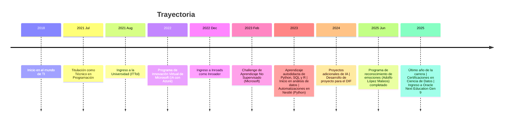

<!-- Banner Superior -->

  

<!-- Encabezado con animación de texto -->

  

---

## 👨‍💻 Sobre mí
🎓 Estudiante de **Ingeniería en Sistemas Computacionales** en el **Instituto Tecnológico de Toluca**.  
💡 Transformo **datos** en conocimiento aplicando análisis, visualización y modelos predictivos.  

**Áreas clave**:
- 🔍 Limpieza y modelado de datos
- 📈 Análisis estadístico y exploratorio
- 🤖 Machine Learning y Deep Learning
- 📊 Dashboards y visualización interactiva

---

## 🛠 Habilidades Técnicas

  

| Categoría              | Tecnologías |
|------------------------|-------------|
| **Lenguajes**          | Python · JavaScript · SQL |
| **Data & ML**          | pandas · NumPy · scikit-learn · matplotlib · seaborn |
| **Bases de Datos**     | MongoDB · MySQL · Oracle |
| **Visualización**      | Power BI · Plotly · Dash |
| **Infraestructura**    | Linux · Git · Docker · Azure ML · Google Cloud AI |

---

## 🚀 Proyectos Destacados
- 😊 **Web de detección de emociones** con IA *(Clasificación en tiempo real)*  
- 🛒 **Sistema de punto de venta** con inventario y control de usuarios  
- 📦 **Inventario para DIF** *(organismo público)*  
- 📱 **Apps móviles** educativas y de salud con React Native  

---
## 🏅 Certificaciones
<!-- ===================== 2025 ===================== -->

  

  
  
  
  

<!-- ===================== 2024 ===================== -->

  

  
  
  

<!-- ===================== 2023 ===================== -->

  

  
  
  

---

## 📊 GitHub Stats

  
  
  

---

## ⏳ Mi Camino

## 💡 Soft Skills
- 🤝 Trabajo en equipo  
- 🗣️ Comunicación efectiva  
- 💡 Creatividad  
- ⏳ Gestión de tiempo  
- 🔄 Adaptabilidad  

---

## 📫 Conecta conmigo

  🌐 <a href="https://jir2406.github.io/" target="_blank">Portafolio</a> • 
  🐙 <a href="https://github.com/JIR2406" target="_blank">GitHub</a> • 
  ✉️ <a href="mailto:jairgarduno47@gmail.com">Correo</a>

<!-- Banner inferior -->

  

  ⚡ Hecho con pasión ❤️, energía ☕ y sueños en código 💡

